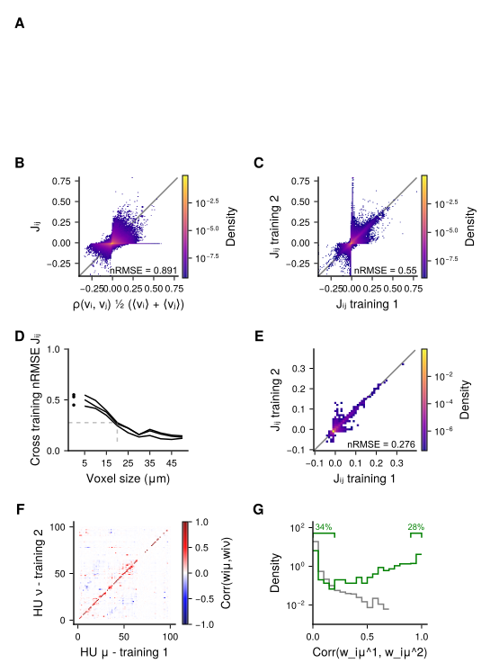

# Zebrafish Shared RBMs - Code and Data

Tools and data for the analysis of whole-brain zebrafish calcium imaging using **Latent aligned Restricted Boltzmann Machines (LaRBMs)**.  
The repository contains Julia modules, Pluto notebooks, and helper scripts used to generate the results and figures for the article : [Shared latent representation enables cross-individual
translation of spontaneous brain activity](https://example.com).

## Table of Contents

1. [Getting Started](#getting-started)  
2. [Repository Structure](#repository-structure)  
3. [Setting Up the Julia Environment](#setting-up-the-julia-environment)  
4. [Data & Model Dependencies](#data--model-dependencies)  
5. [Recomputing Datasets](#recomputing-datasets)  
5. [Recomputing RBMs](#recomputing-rbms)  
6. [Recomputing Figures and Movies](#recomputing-figures-and-movies)  
7. [Utilities](#utilities)  
8. [System Requirements](#system-requirements)  
9. [License](#license)

## Getting Started

Clone the repository (with submodules) :

```bash
git clone --recurse-submodules https://github.com/EmeEmu/ZebrafishSharedRBMs.git
cd ZebrafishSharedRBMs
```
If you cloned without submodules:
```bash
git submodule update --init --recursive
```

The present repository contains only high-level analyses and methods. Low-level methods are included as submodules :
- [BrainRBMjulia](https://github.com/EmeEmu/BrainRBMjulia/) : contains all the methods used to work with RBMs.
- [BiTrainedRBMs.jl](https://github.com/BiRBMs2024/BiTrainedRBMs.jl) : contains the methods for the LaRBMs.

Both submodules are extensions of the julia package [RestrictedBoltzmannMachines.jl](https://github.com/cossio/RestrictedBoltzmannMachines.jl).


## Repository Structure

```
.
├── Analysis/                 # Pluto notebooks for dataset creation, model training and evaluation
│   └── ···
├── Figures/                  # Pluto notebooks for paper figures and movies
│   ├── ···
│   ├── Panels/                 # Output directories for individual figure panels and movies
│   ├── conventions.jl          # Color conventions and paths
│   └── styles.jl               # Plotting styles
├── Misc_Code/                # Helper scripts (figure saving, loaders, interpolation, etc.)
│   ├── KernelInterpolation.jl  # Module to compute similarity metrics between neuronal maps
│   ├── clean_weights.jl        # Script to clean weight maps from bRBM_*.h5 files
│   ├── fig_saving.jl           # Automatic figure saving paths
│   └── loader.jl               # Automatic loading of data and model files from Zenodo
├── Modules/                  # External modules (git submodules)
│   ├── BiTrainedRBMs.jl/
│   ├── BrainRBMjulia/
│   └── BrainViewer/
├── datadeps.jl               # Definitions of DataDeps for datasets and pretrained RBMs
├── Project.toml              # Julia project dependencies
└── Manifest.toml             # Full reproducible environment

```
Data and trained RBMs are downloaded on demand from the [Zenodo repository](https://zenodo.org/records/17121390) and stored in `DataAndModels/` (created automatically).


## Setting Up the Julia Environment

### Install Julia

The project targets **Julia ≥ 1.11.5**.  
Install from [julialang.org](https://julialang.org/downloads/) or via [Juliaup](https://github.com/JuliaLang/juliaup) for managing multiple versions.

### Dependencies

The environment can be fully repoduced from the `Manifest.toml` by running the following :
```julia
using Pkg
Pkg.activate(".")      # Activate this repository
Pkg.instantiate()      # Install/compile all dependencies
```

### Running Pluto notebooks

```julia
using Pluto
Pluto.run()
```
Open the desired `.jl` notebook from `Analysis/` or `Figures/`.


## Data & Model Dependencies

This project uses [DataDeps.jl](https://github.com/oxinabox/DataDeps.jl) to fetch large datasets and pretrained models hosted on Zenodo [here](https://zenodo.org/records/17121390). All datasets are listed in `datadeps.jl`.  
All files are stored in `DataAndModels/` and downloaded automatically when first requested.  
The paths of data, model, and pre-computation files can be obtained using the methods in `loader.jl`. For example to get the path the Whole-Brain Single-Cell binarized spikes of the fish names *Eglantine*, you can run :
```julia
include(joinpath(dirname(Base.current_project()), "Misc_Code", "loaders.jl"))
load_dataWBSC("Eglantine")
```

The total size on disk of the entire and uncompressed data dependencies is **~60GB**. Additional disk space can be needed for certain computations (see bellow).

All data and model files are [HDF5](https://en.wikipedia.org/wiki/Hierarchical_Data_Format) files (`.h5`), with embeded documentation as *attributes*. You can get the layout of a given file by running :
```julia
using HDF5
h5open("/path/to/file.h5", "r")
```


## Recomputing Datasets

All datasets are already precomputed. The rest of this section describes how to recompute them from segmented recordings (available [here](http://example.com)).

### Voxelized datasets

Constuction of Whole-brain voxelized datasets is done with the notebook `Analysis/Dataset_builder.jl`. This creates `VOXgrid.h5` files stored in `DataAndModels/Data_VOX/Voxelgrids/`, and `VOXsize_FishName.h5` files stored in `DataAndModels/Data_VOX/Voxelized/`.

### Whole-brain single-neuron datasets

Constuction of whole-brain single-cell datasets is done with the notebook `Analysis/Dataset_builder.jl`. This creates `DATA_FishName.h5` files stored in `DataAndModels/Data_WBSC/WBSC/`.


## Recomputing RBMs

All RBMs are already precomputed, and available through the `DataDeps` prodedure described above.

The rest of this section describes how to recompute them. Bare in mind that RBMs are stochastic, therefore retraining will result in different models than those used in the article.
As training can be long, and some computation can require a lot of RAM or disk space, most notebooks contain interactive switches to launch computations on demand, and some cells have been disabled.

#### Voxelized RBMs

We provide three notebooks to train and validate voxelized RBMs :

- `Analysis/VoxelizedSingleFishTraining.jl` : train an RBM from a single fish. The fish and training parameters can be selected interactively. Two methods are provided for either a single or repeated trainings.
- `Analysis/VoxelizedMultiFishTraining.jl` : train an RBM from multiple fish. The training parameters can be selected interactively. Two methods are provided for either a single or repeated trainings.
- `Analysis/Voxelized_CrossValidation.jl` : cross validate training hyperparameters for a single-fish training. The fish can be selected interactively.

#### Single-Neuron RBMs

We provide three notebooks to train and validate Whole-Brain Single-Cell RBMs :

- `Analysis/WholeBrainSingleFishTraining.jl` : train an RBM from a single fish. The fish and training parameters can be selected interactively. Two methods are provided for either a single or repeated trainings.
- `Analysis/WholeBrainSingleFishStudentTraining.jl` : train a student RBM from a given teacher. Both teacher and students can be selected interactively. In order to run this code you first need to precompute the teacher weight maps using `Analysis/BuildingWeightMaps.jl` (be carefull this requires ~15GB extra disk space per fish; maps can be removed using `Modules/clean_weights.jl` to free disk space).
- `Analysis/WholeBrainSingleFishAnalysis.jl` : investigate and evaluate a trained RBM. This notebook is not required for figures or other analyses, but is helpfull to study RBMs in more detail.


## Recomputing Figures and Movies

All figures and movies are already precomputed and available in the directory `Figures/Panels/`.

### Fig.1 and S1


Figure 1 and associated supplementary figure are produced with the notebook `Figures/Fig_Degen.jl`. This notebook requires the precomputation of `Analysis/Degenerecense.jl` which requires a lot of compute time of disk space (~60GB). 

### Fig.2 and S2-4


Figure 2 and associated supplementary figures are produced with the notebook `Figures/Fig_Voxelized.jl`. This notebook requires the voxelized dataset and voxelized RBMs, which are available as `DataDeps` or can be recomputed as described previously.

### Fig.3 and S5-7


Figure 3 and associated supplementary figures are produced with the notebook `Figures/Fig_Reinit_training.jl`. This notebook requires the whole-brain single-neuron dataset, teacher and student RBMs, which are available as `DataDeps` or can be recomputed as described previously. It also requires the precomputed metrics between weight maps `WeightDist_6fish_WBSC_*.h5` which is created by `Analysis/Weight_Map_Distance.jl`. For conveniance we also provide this file as a `DataDeps`.

### Fig.4 and S8-10


Figure 4 and associated supplementary figures are produced with the notebook `Figures/Fig_DeepFake.jl`. This notebook requires the whole-brain single-neuron dataset, teacher and student RBMs, which are available as `DataDeps` or can be recomputed as described previously. It also requires several precomputation `DeepFake*.h5` which are created by `Analysis/DeepFake.jl`. For conveniance we also provide these files as `DataDeps`.

### Movies 1-4

Movies 1 to 4 are available inside this repo, as well as on Zenodo [here](https://zenodo.org/records/16886749). They are created with the following notebooks :
- Mov.1 : `Figures/Mov_SpontActivity.jl`
- Mov.2 : `Figures/Mov_HiddenSampling.jl`
- Mov.3-4 : `Figures/Mov_TeacherStudent.jl`


## Utilities

The Misc_Code/ directory contains small, reusable utilities:

- `fig_saving.jl` : Simplifies saving Makie figures to SVG/MP4.
- `loaders.jl` : Common dataset/model loaders.
- `KernelInterpolation.jl` : metrics between neuronal maps.
- `clean_weightmaps.jl` : cleaning weight-maps from `bRBM*.h5` files after running `Analysis/BuildingWeightMaps.jl` to same disk space.


## System Requirements

All analyses were performed on a Linux machine (Ubuntu 20.04) with:

- **CPU** : AMD Ryzen 9 3950X (16 cores)
- **GPU** : NVIDIA RTX 3080 Ti (12 GB)
- **RAM** : 128 GB

Lower-spec machines should work, but certain steps may require ~60 GB of RAM.


## License

All code and data presented here is under GPL v.3 licence.
